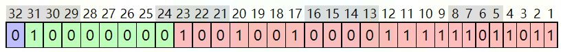
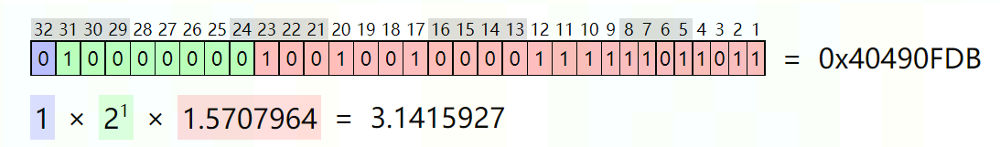
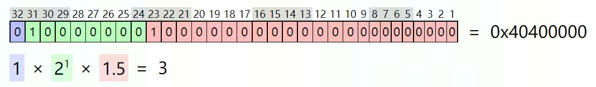
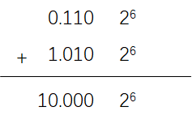

# 巧用对阶运算对浮点数求整

有些硬件架构不支持原生的求整操作，这个时候怎么求整就成了一个问题。在这种情况下可以利用我们对 `IEEE-754` 浮点数加法运算过程的理解来完成一个巧妙的求整操作。

## 预备知识

### `IEEE-754` 浮点表示
- 单精度浮点
	
  可以看到，单精度浮点在计算机中占 32 个 bits，其中第 31 个 bit 为符号位（S，1 bit），第 23 至第 30 个 bit 为指数部分 （E，8 bits），第 0 至第 22 个 bit 为尾数部分（M，23 bits）。表示的数为：$(-1)^{S} \times 1.M \times 2 ^ e$，其中 $e=E-127$。
  
  从这个表示，做个简单的思想实验，我们其实是可以得到这个浮点数的整型部分的，即把尾数部分的后面 $23 - e$ 个 bits 抹掉。这是因为 $(1.M)_2$ 右移 $e$ 个 bits 再把小数部分去掉，即为整数部分。而浮点数因为不同的 bit 域代表不同的意思，很难通过简单右移的方式来解决问题，所以转而去想是否可以通过抹掉尾数的方式来做。
  > 举个例子：
  > 
  > 上图 3.1415927 取整为 3，用抹尾数的方式怎么做呢？
  > 指数位为 1，意味着需要把 23 个尾数 bits 抹掉后 22 个，只剩 1位，即：
  > 
  > 可以看到数变成了 $(1.1)_2 \times 2^1 = (1.5 \times 2)_{10} = 3$
  >  这个方法是 OK 的。
  
  下一步就是怎么来抹尾数了。

- 浮点数加法
  `IEEE-754` 规定在进行浮点数加减运算时，首先要对准小数点，具体就是要使两个操作数的指数部分一致，即阶码一致, 这个过程叫对阶（exponent matching）。

  > 举个例子：
  >
  > 计算 $a = (1.101)_2 \times 2^5$ 与 $b = (1.010)_2 \times 2^6$ 的和需要 $a$ 先对阶到 $2^6$，即变成 $a = (0.1101)_2 \times 2^6$，再对位加就可以了，如下：
  >
  > 
  >
  > 可得 $(1.000)_2 \times 2 ^5$
  
  在对阶时，使用的原则是小阶对大阶，即阶小的数通过尾数右移的方式变成大阶，需要右移 $大阶-小阶$ 位，每右移一位其实就相当于抹掉了一个尾数的 bit。那要抹 $23-e$ 个 bits，那这个数与数 $2^{23}$ 作加减就可以了。
  到现在，基本思路就形成了。

## 算法

现在基于上面的基本思路完整化：

- 如果目标数的阶码小于等于 $23$，当它与 $2^{23} = 8388608$ 这个浮点数相加时，就会自动对阶到阶码 $23$，从而右移抹掉 $23-e$ 位的尾数；
- 如果目标数的阶码大于 $23$，所有的尾数都属于整数部分，所以不需要动。此时，当它与 $2^{23} = 8388608$ 这个浮点数相加时，$8388608$ 就会自动对阶到目标数的阶码，从而不影响当前数的表达；

综上，算法如下：

```python
- input: a
- output: d = int(a)
- procedure:
	- a' = abs(a)
	- b = a' + 8388608
	- c = b - 8288608
	- d = sign(a) * c
```

# References
1. [float toy](https://evanw.github.io/float-toy/)
2. [IEEE-754 Floating Point Converter](https://www.h-schmidt.net/FloatConverter/IEEE754.html)
3. [Floating Point Addition](https://cse.hkust.edu.hk/~cktang/cs180/notes/lec21.pdf)