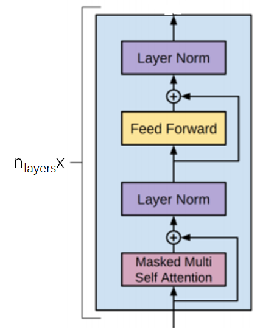
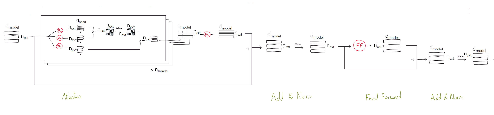

# Transformer block 拆解

## 基本结构

> **基本参数**
> - $n_{layers}$ or $L$: total number of transformer blocks
> - $d_{model}$ or $H$: number of units in each bottleneck layer, and number of units of each Q/K/V input
> - $n_{heads}$ or $A$: number of heads of each transformer block
> - $n_{cxt}$ or $seq\_len$: input sequence length
> 
> **其它参数**
> - $d_{head}$: dimension of each attention head, $\frac{d_{model}}{n_{heads}}$
> - $d_{ff}$: intermediate layer units of feed forward layer, $4 \times d_{model}$

各参数在 transformer block 中的详细示意图如下：

## Zoom in Feed Forward 子模块

## 典型模型基本参数

| 应用 | 模型 |$n_{layers}$| $d_{model}$|$n_{heads}$|$n_{ctx}$|
|  :----  | :----  |:---- |  :----:  |  :----:  | :----:  |
| NLP | GPT-3 | 96 | 12288 | 96 | 2048 |
| NLP | BERT_Base | 12 | 768 | 12 | 128/512 |
| NLP | BERT_Large | 24 | 1024 | 16 | 128/512 |

## 参考文献

1. [The GPT-3 Architecture, on a Napkin](https://dugas.ch/artificial_curiosity/GPT_architecture.html)
2. [GPT-3 An Overview](https://dzlab.github.io/ml/2020/07/25/gpt3-overview/)
3. [Language Models are Few-Shot Learners](https://arxiv.org/pdf/2005.14165.pdf)
2. [Improving Language Understanding by Generative Pre-Training](https://s3-us-west-2.amazonaws.com/openai-assets/research-covers/language-unsupervised/language_understanding_paper.pdf)
3. [BERT: Pre-training of Deep Bidirectional Transformers for Language Understanding](https://arxiv.org/pdf/1810.04805.pdf)
4. [Attention Is All You Need](https://arxiv.org/pdf/1706.03762v5.pdf)
5. [BERT transformer block code](https://github.com/google-research/bert/blob/eedf5716ce1268e56f0a50264a88cafad334ac61/modeling.py#L558)
6. [Deep Learning Recommendation Model for Personalization and Recommendation Systems](https://arxiv.org/pdf/1906.00091.pdf)
7. [Behavior Sequence Transformer for E-commerce Recommendation in Alibaba](https://arxiv.org/pdf/1905.06874v1.pdf)

*写于 2021 年 7 月*