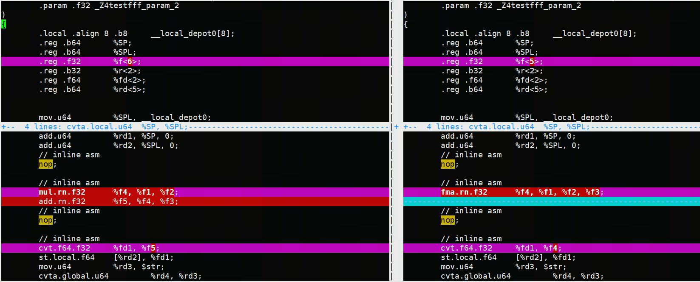

# Vector FMA 数值问题分析

## 问题背景

`deform_roi_pool` 算子在测试的时候某些测例的 MLU 结果与 CPU 结果一致，但是与 NV GPU 结果不一致。最终定位到问题出现在求坐标 `(x，y)` 时，由于 GPU 使用的是 `FMA` 指令，而 MLU 和 CPU 则是乘和加两次操作，从而引入了一定误差，在后续计算中这个误差被逐步放大。

## 问题剖析

### 为什么会有误差？

`FMA（Fused Multiply Add，融合乘加）`，就是将乘法和加法融合在一条指令完成:

$$ d= a * b + c $$

性能上来说，`FMA` 比分别使用 `MUL`和 `ADD` 两条指令快 1 倍。精度上，也因为只做一次 `rounding` 而更高。NV CUDA Floating Point 手册表述如下：

> The FMA operation computes `rn(X × Y + Z)` with only one rounding step. Without the FMA operation the result would have to be computed as `rn(rn(X × Y) + Z)` with two rounding steps, one for multiply and one for add. Because the FMA uses only a single rounding step the result is computed more accurately.

### FMA在不同情况下的影响
下面的示例抛开了 `deform_roi_pool` 算子实现，通过一个例子展示 FP32 `FMA` `on` 和 `off` 带来的精度影响。

```cpp
float y1 = a * x + b;
float tmp = a * x;
float y2 = tmp + b;

// case 1
float result1 = y1;
float result2 = y2;

// case 2
float nums[2] = {-1000, 1000};
int y1_low = int(y1);
int y2_low = int(y2);
int result1 = nums[y1_low];
int result2 = nums[y2_low];
```
- case 1

    `FMA` 带来的误差仅是其本身的误差，即 `FMA` 的一次 `rounding`，与 `MUL + ADD` 两次 `rounding` 之间的误差。
    
    比如：`FMA` 计算得到 `y1 = 0.999998`；而 `MUL + ADD` 得到`y2 = 1`。则，`result2 - result1 = 0.000002`。

- case 2

  `FMA` 误差可能会最终导致数组索引错误。
  比如：`FMA` 计算得到 `y1 = 0.999998`，因此 `y1_low = 0`；而 `MUL + ADD` 得到 `y2 = 1`，此时 `y2_low = 1`。则，`result2 - result1 = 2000`。

## PTX 分析
分析如下 `CUDA` 代码：

```cpp
__global__ void test(float a, float b, float x) {
        asm volatile("nop;\n\t");
        float y = x + a * b;
        asm volatile("nop;\n\t");
        printf("y: %f", y);
}
```

其中，`asm volatile("nop;\n\t");` 是作为路标加入的，当代码段很多的时候，可以在 `ptx` 中直接搜索 `nop`，以更快定位自己想要找的位置。

编译 `CUDA` 文件：

```shell
$ nvcc -fmad=false add.cu -ptx -arch sm_70
$ nvcc -fmad=true add.cu -ptx -arch sm_70
```

查看 `FMA` `off` 和 `on` 两种情况下生成的 `add.ptx`，如下（左为`off`，右为 `on`）：



## 变相取消 `FMA`

对于能够自己编译的工程，可以用上述方法取消 `FMA` 后重新生成结果，进行对比。但是有些工程比较复杂，可能不好找到工程是如何进行编译的，此时可以通过对代码进行修改，从而达到取消 `FMA` 的目的。

```cpp
__global__ void test(float a, float b, float x) {
        printf("a*b: %f\n", a*b);
        asm volatile("nop;\n\t");
        float y = x + a * b;
        asm volatile("nop;\n\t");
        printf("y: %f", y);
}
```

上述代码相比于之前的代码，多了一行: `printf("a*b: %f\n", a*b);`通过这个打印，就能取消计算 `y` 时使用的 `FMA` 操作。

从下面的 `ptx` 中可以看出 `FMA` 被取消了，原因很简单：因为 `a * b` 会被使用，因此会提前计算出来，那么对于 `y` 的计算中 `a * b` 就是已知值，因此无需 `FMA` 操作了。

```
.visible .entry _Z4testfff(
        .param .f32 _Z4testfff_param_0,
        .param .f32 _Z4testfff_param_1,
        .param .f32 _Z4testfff_param_2
)
{
		// 删除无关部分
        // ...
        ld.param.f32    %f1, [_Z4testfff_param_0];
        ld.param.f32    %f2, [_Z4testfff_param_1];
        ld.param.f32    %f3, [_Z4testfff_param_2];
        add.u64         %rd1, %SP, 0;
        add.u64         %rd2, %SPL, 0;
        mul.f32         %f4, %f1, %f2;
        // 删除无关部分
        // ...
        // inline asm
        nop;

        // inline asm
        add.f32         %f5, %f4, %f3;
        // inline asm
        nop;

        // inline asm
```

## MLU 行为

MLU 3xx 及之前的芯片不支持向量 `FMA` 指令。因此在这些芯片上， `__bang_fusion(FUSION_FMA, ...)` 指令乘法和加法运算是在两组运算器上完成的，输入数据顺序流过这个两组运算器，仍然需要两次 `rounding`，虽然吞吐为单独乘加的两倍。

## References
1. [CUDA Tookit Documentation - FMA](https://docs.nvidia.com/cuda/floating-point/index.html#fused-multiply-add-fma)
2. [Precision and Performance: Floating Point and IEEE 754 Compliance for NVIDIA GPUs](https://docs.nvidia.com/cuda/pdf/Floating_Point_on_NVIDIA_GPU.pdf)

*写于 2023 年 2 月*