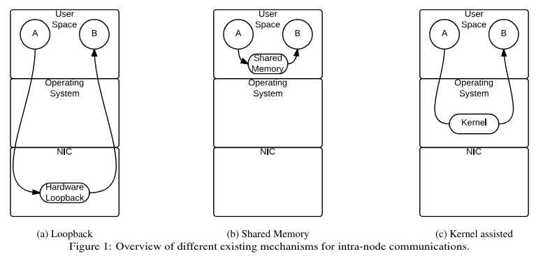

# Intel 显卡单机多卡 FSDP 模型 checkpointing 时 Assert Out

## 现象

使用 Hugging Face `Trainer` 在单机多卡环境下对 `LLAMA2-7B` 进行 LoRA finetuning 时，在第一次保存 checkpoint 时，程序 assert out，关键 error trace log 如下：

```
[1711969312.876608051] rank2.python: Reading from remote process' memory failed. Disabling CMA support

[1711969312.876606027] rank4.python: Reading from remote process' memory failed. Disabling CMA support

[1711969312.876618213] rank5.python: Reading from remote process' memory failed. Disabling CMA support

rank5: Assertion failure at psm3/ptl_am/ptl.c:196: nbytes == req->req_data.recv_msglen

rank2: Assertion failure at psm3/ptl_am/ptl.c:196: nbytes == req->req_data.recv_msglen
```

## 根因

### 顺藤摸瓜

1.  `accelerate` 的 FSDP 在保存 checkpoint 时，会调用其自己的 [`save_fsdp_optimizer`](https://github.com/huggingface/accelerate/blob/c470a1336a7a2711f9903807a81a8fecf60cc1b2/src/accelerate/utils/fsdp_utils.py#L152) 方法，该方法首先[调用了 PyTorch 的 `FSDP.optim_state_dict`](https://github.com/huggingface/accelerate/blob/c470a1336a7a2711f9903807a81a8fecf60cc1b2/src/accelerate/utils/fsdp_utils.py#L157) 方法以获取并确保每个 `rank` 上都有其需要的最新的 `optimizer` 的 `state_dict`，然后根据相应的 `fsdp_state_dict_type` 设置将其保存。Assert out 就发生在 `FSDP.optim_state_dict` 调用中。

2. 找到 PyTorch [`FSDP.optim_state_dict` 的实现](https://github.com/pytorch/pytorch/blob/e3ac61587aa368c613ef01df1f328a396b64cd5d/torch/distributed/fsdp/fully_sharded_data_parallel.py#L1827)，发现 assert out 发生在调用 [`FullyShardedDataParallel._optim_state_dict_impl`](https://github.com/pytorch/pytorch/blob/e3ac61587aa368c613ef01df1f328a396b64cd5d/torch/distributed/fsdp/fully_sharded_data_parallel.py#L1827) 时。

3. 再转至 [`FullyShardedDataParallel._optim_state_dict_impl` 的实现](https://github.com/pytorch/pytorch/blob/e3ac61587aa368c613ef01df1f328a396b64cd5d/torch/distributed/fsdp/fully_sharded_data_parallel.py#L1211)，发现 assert out 发生在其调用 [`_optim_state_dict`](https://github.com/pytorch/pytorch/blob/e3ac61587aa368c613ef01df1f328a396b64cd5d/torch/distributed/fsdp/fully_sharded_data_parallel.py#L1211) 时。

4. 继续转至 [`_optim_state_dict` 的实现](https://github.com/pytorch/pytorch/blob/e3ac61587aa368c613ef01df1f328a396b64cd5d/torch/distributed/fsdp/_optim_utils.py#L1864)，发现 assert out 发生在其调用 [`_map_param_key_to_optim_keys`](https://github.com/pytorch/pytorch/blob/e3ac61587aa368c613ef01df1f328a396b64cd5d/torch/distributed/fsdp/_optim_utils.py#L1956) 时。

5. 继续转至 [`_map_param_key_to_optim_keys` 的实现](https://github.com/pytorch/pytorch/blob/e3ac61587aa368c613ef01df1f328a396b64cd5d/torch/distributed/fsdp/_optim_utils.py#L1189)，发现 assert out 发生在调用 [`dist.broadcast_object_list`](https://github.com/pytorch/pytorch/blob/e3ac61587aa368c613ef01df1f328a396b64cd5d/torch/distributed/fsdp/_optim_utils.py#L1241)。

至此，瓜已得，需分析 [`dist.broadcast_object_list`](https://github.com/pytorch/pytorch/blob/e3ac61587aa368c613ef01df1f328a396b64cd5d/torch/distributed/distributed_c10d.py#L2578)。

### 抽丝剥茧

1. 首先需要分析  `dist.broadcast_object_list` broadcast 了啥，看下代码：
    ``` python
	key_obj_list: List[Optional[List[_OptimStateKey]]] = (
     [all_optim_state_keys] if rank == 0 else [None])
	dist.broadcast_object_list(key_obj_list, src=0, group=group)
	```
	由代码可知，broad cast 的是一堆 [`_OptimStateKey`](https://github.com/pytorch/pytorch/blob/e3ac61587aa368c613ef01df1f328a396b64cd5d/torch/distributed/fsdp/_optim_utils.py#L117)，而 `_OptimStateKey` 是一个字符串组成的 `tuple`，每个字符串里放的是optimizer 中每个模型参数的状态（即 momentum, variance 等）的 unflat 的 [fully qualified name](https://en.wikipedia.org/wiki/Fully_qualified_name)。这些东西是在 CPU 上的，需要由 rank 0 广播到其余 rank，以对齐参数名。  

2. 好了，知道数据是在 CPU 上的，那就知道为啥在 checkpointing 之前是好的了，因为此前都是涉及到 GPU 上 tensor 的 collective communication，那块看来是好的。Intel CPU 和 GPU 平台的 collective communication 后端走的是 [oneCCL](https://github.com/oneapi-src/oneCCL)，其中 CPU 上数据的单机多卡 broadcast 走的是什么方案呢？再去看一眼 log：
	```
	[1711969312.876608051] rank2.python: Reading from remote process' memory failed. Disabling CMA support
	```
    从 log 中大致可以猜出通信方案是 shared memory(SHM)，不然不会有 `Reading from remote process' memory failed`，这很合理，因为是单机多卡；且采用的 SHM 方案是 [CMA(Cross Memory Attach)](https://git.kernel.org/pub/scm/linux/kernel/git/torvalds/linux.git/commit/?id=fcf634098c00dd9cd247447368495f0b79be12d1)，这是 Linux 内核实现的一种 kernel assisted zero copy SHM 机制，示意如下（摘自[此论文](https://www.researchgate.net/profile/Jerome-Vienne/publication/266659710_Benefits_of_Cross_Memory_Attach_for_MPI_libraries_on_HPC_Clusters/links/576955fc08ae3bf53d331892/Benefits-of-Cross-Memory-Attach-for-MPI-libraries-on-HPC-Clusters.pdf)）：

    

    那就是 CMA 出了啥问题。以上只是猜想，猜想只是起点，总是要实证。既然 oneCCL 是集合通信后端，我们就要分析一下它。从[这儿](https://oneapi-src.github.io/oneCCL/env-variables.html)可以知道：oneCCL 有两个 transport 后端， 即 OFI 和 MPI。从[这儿](https://www.intel.com/content/www/us/en/developer/articles/technical/mpi-library-2019-over-libfabric.html)又可以知道，intel MPI 的实现现在也基于 OFI 了，而 OFI 的实现是 libfabric，如下：

	

    那么我们就去 [libfabric 的代码库](https://github.com/ofiwg/libfabric)中找找有没有以下 log 相关的代码：

	```
	[1711969312.876608051] rank2.python: Reading from remote process' memory failed. Disabling CMA support
	rank2: Assertion failure at psm3/ptl_am/ptl.c:196: nbytes == req->req_data.recv_msglen
	```

    然后就从[这里](https://github.com/intel/eth-psm3-fi/blob/master/psm3/ptl_am/ptl.c#L200)到了如下代码：
	``` cpp
	size_t nbytes = psm3_cma_get(pid, (void *)req->rts_sbuf, req->req_data.buf, req->req_data.recv_msglen);
	if (nbytes == -1) {
		ptl->psmi_kassist_mode = PSMI_KASSIST_OFF;
		_HFI_ERROR("Reading from remote process' memory failed. Disabling CMA support\n");
	}
	else {
		psmi_assert_always(nbytes == req->req_data.recv_msglen);
		cma_succeed = 1;
	}
	psmi_assert_always(nbytes == req->req_data.recv_msglen);
	```
    从代码可以看到, `psm3_cma_get` 调用返回错误，首先触发了 `Reading from remote process' memory failed. Disabling CMA support\n` 错误信息打印，随后又通过 `psmi_assert_always` assert out 了，与我们看到的 log 完全一样。至此，丝抽完了，已经找到问题发生的地方了。

3. 转到 [`psm3_cma_get`](https://github.com/ofiwg/libfabric/blob/main/prov/psm3/psm3/ptl_am/cmarwu.c#L152) 的实现代码，可知是 `process_vm_readv` 返回错误了。查看 `process_vm_readv` 的[手册](https://man7.org/linux/man-pages/man2/process_vm_readv.2.html)可以看到如下表述：
    > Permission to read from or write to another process is governed by a ptrace access mode PTRACE_MODE_ATTACH_REALCREDS check; see ptrace(2).

	因为 CMA 涉及到进程访问别的进程的内存，一个有可能的合理怀疑就是当前进程没有权限访问另一个进程的内存，这个也通过 [CMA patch the commit message](https://git.kernel.org/pub/scm/linux/kernel/git/torvalds/linux.git/commit/?id=fcf634098c00dd9cd247447368495f0b79be12d1) 得到了印证，其中写道：
    > Currently mem_read allows only processes who are currently ptrace'ing the target and are still able to ptrace the target to read from the target.
 
    那就上谷歌搜一下 `cma ptrace` 看下 `CMA` 需要怎样的 `ptrace` 设置，果然首个[链接](https://github.com/microsoft/WSL/issues/3397)就找到了答案。
    > Same issue... Try the following:
    >
    > https://groups.io/g/OpenHPC-users/topic/openmpi_and_shared_memory/16489081?p=,,,20,0,0,0::recentpostdate%2Fsticky,,,20,2,0,16489081
    >
    > \$ echo 0 > /proc/sys/kernel/yama/ptrace_scope
    >
    > or
    >
    > \$ sudo echo 0 > /proc/sys/kernel/yama/ptrace_scope
    >
    > or
    >
    > $ echo 0 | sudo tee /proc/sys/kernel/yama/ptrace_scope

尝试一下，搞定！

## 解法

> $ echo 0 > /proc/sys/kernel/yama/ptrace_scope

`ptrace_scope` 说明见[此处](https://www.kernel.org/doc/Documentation/security/Yama.txt)。所测系统之前 `ptrace_scope` 值是 `1`。也就是说，非 rank 0 的进程要读 rank 0 的 SHM，必须满足 rank 0 是它们的后代进程才行，这显然不符合当前工作负载的实情。所以需要设成 `0`，以使得主要这些进程是同一个 `uid` 下的就可以读 SHM。

## 最后的话

当前来看，结果很重要；长远来看，过程很重要！这是工程的真谛。